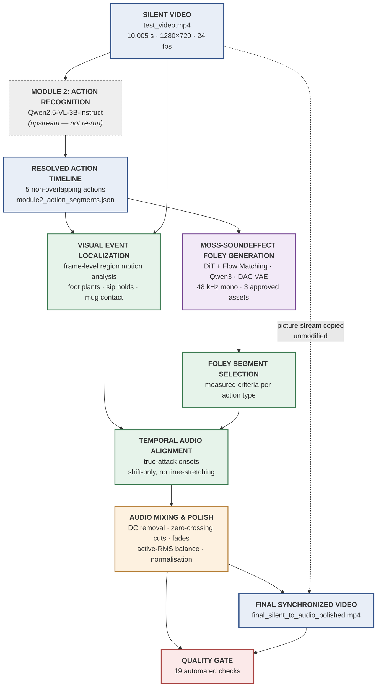

# Module 3 — System Architecture

**Document version:** 1.0 (final)

This document specifies the block-level architecture of Module 3. Each block states its inputs,
processing, outputs, and the source file that implements it.

---

## 1. Top-level block diagram



### Plain-text equivalent

```
                        SILENT VIDEO
                             |
                +------------+------------+
                |                         |
                v                         |
        MODULE 2: ACTION RECOGNITION      |
          (upstream, not re-run)          |
                |                         |
                v                         |
        RESOLVED ACTION TIMELINE          |
                |                         |
        +-------+-------+                 |
        |               |                 |
        v               v                 |
   MOSS-SOUNDEFFECT   VISUAL EVENT <------+
   FOLEY GENERATION   LOCALIZATION
        |               |
        v               v
   FOLEY SEGMENT   TEMPORAL AUDIO
     SELECTION  -->   ALIGNMENT
                        |
                        v
              AUDIO MIXING & POLISH
                        |
                        v
              FINAL SYNCHRONIZED VIDEO
                        ^
                        |
        picture stream copied unmodified from source
```

---

## 2. Block specifications

### Block 1 — Silent Video (input)

| | |
|---|---|
| **Input** | — (external) |
| **Artefact** | `input/test_video.mp4` |
| **Specification** | 10.005 s container, 10.000 s video stream, 240 frames, 1280×720, h264, 24 fps |
| **Integrity** | SHA-256 `a620ee58…`, verified before and after every build |
| **Output** | picture stream; timing reference |

The source carries an AAC track from the original recording. It is never read: the visual analysis
decodes only the video stream, and the final mux maps audio exclusively from the generated mix.

### Block 2 — Module 2: Action Recognition (upstream)

| | |
|---|---|
| **Input** | silent video |
| **Model** | Qwen/Qwen2.5-VL-3B-Instruct, 2.0 s windows at 1.0 s stride |
| **Output** | `module2_action_segments.json` |
| **Status** | **upstream dependency — not re-run and not modified by Module 3** |

### Block 3 — Resolved Action Timeline

| | |
|---|---|
| **Input** | `module2_action_segments.json` |
| **Processing** | select the `resolved_actions` array (deterministic, non-overlapping) over the raw `actions` array (overlapping) |
| **Output** | 5 action spans with status flags |
| **Implements** | `scripts/m3_config.py`, `scripts/sync_actions.py` |

### Block 4 — MOSS-SoundEffect Foley Generation

| | |
|---|---|
| **Input** | text prompt, optional negative prompt |
| **Model** | MOSS-SoundEffect v2.0 — DiT (1,416 M) + Qwen3 encoder (1,721 M) + DAC VAE (372 M) |
| **Execution** | Apple M4, MPS, bfloat16, three-phase loading |
| **Output** | 48 kHz mono WAV, 10 s (30 s denoised internally, then cropped) |
| **Implements** | `scripts/moss_phased.py`, `scripts/moss_generate.py` |
| **Status in final pipeline** | **not re-executed** — the approved assets are read from disk |

### Block 5 — Visual Event Localization

| | |
|---|---|
| **Input** | silent video, resolved action timeline |
| **Processing** | ffmpeg → 320×180 greyscale at 24 fps; mean absolute inter-frame difference per region band; per-action event detection |
| **Regions** | feet 0.62–1.00 · head 0.00–0.50 · table 0.40–0.85 (fractions of frame height) |
| **Output** | `results/visual_events.json` — 6 events with kind and confidence |
| **Implements** | `scripts/visual_events.py` |

Detection strategy differs by action type: foot plants are motion peaks resolved to the following
minimum; sip holds are sustained motion minima; mug contact is the final motion peak before rest.

### Block 6 — Foley Segment Selection

| | |
|---|---|
| **Input** | approved Foley assets, visual events |
| **Processing** | measured selection criteria per action type |
| **Output** | source time ranges |
| **Implements** | `scripts/sync_actions.py`, `scripts/make_placement_asset.py` |

### Block 7 — Temporal Audio Alignment

| | |
|---|---|
| **Input** | selected segments, visual event timestamps |
| **Processing** | true-attack onset detection; translation so the audible onset coincides with the visual event; for walking, consecutive step-run matching against the filmed gait |
| **Constraint** | **shift only — no time-stretching, resampling, or regeneration** |
| **Output** | `results/sync_plan.json` |
| **Implements** | `scripts/sync_actions.py` |

### Block 8 — Audio Mixing & Polish

| | |
|---|---|
| **Input** | synchronisation plan, approved assets |
| **Processing** | DC removal → zero-crossing snap (±3 ms) → 12 ms raised-cosine fades → active-RMS levelling → per-clip peak cap → sum → linear normalisation → safety limiter |
| **Output** | `audio/mixed/final_synchronized_audio_polished.wav` |
| **Implements** | `scripts/polish_mix.py` |

### Block 9 — Final Synchronized Video

| | |
|---|---|
| **Input** | original video, polished audio |
| **Processing** | `ffmpeg -map 0:v:0 -map 1:a:0 -c:v copy -c:a aac -ar 48000` |
| **Output** | `output/final_silent_to_audio_polished.mp4` |
| **Implements** | `scripts/build_polished_video.py` |

The video stream is copied, not re-encoded. The output picture is bit-identical to the source.

### Block 10 — Quality Gate

| | |
|---|---|
| **Input** | polished audio, final video, plan, source assets |
| **Processing** | 19 automated checks; synchronisation accuracy measured on the **rendered audio**, not asserted from the plan |
| **Output** | `results/qa_polished.json` |
| **Implements** | `scripts/qa_polished.py` |

---

## 3. Data-flow summary

| Stage | Artefact produced |
|---|---|
| Visual localisation | `results/visual_events.json` |
| Alignment planning | `results/sync_plan.json` |
| Placement asset derivation | `audio/generated/cup_placement_foley_final.wav` |
| Mixing and polish | `audio/mixed/final_synchronized_audio_polished.wav`, `results/polish_log.json` |
| Video assembly | `output/final_silent_to_audio_polished.mp4` |
| Verification | `results/qa_polished.json` |
| Final record | `results/final_synchronization_polished.json` |

---

## 4. Design constraints enforced by the architecture

| Constraint | Enforcement |
|---|---|
| Source video never modified | `-c:v copy`; SHA-256 asserted in the quality gate |
| Approved Foley never modified | assets are filesystem write-protected (`r--r--r--`); SHA-256 asserted |
| MOSS repository never modified | `git status --porcelain` asserted empty; all compatibility handling lives in the wrapper |
| Module 2 output never modified | read-only consumption |
| No fabricated audio | actions without an approved asset are declared unavailable and asserted silent |
| No time-stretching of approved audio | alignment is translation-only by construction |

---

*End of architecture specification.*
