# Module 3 — Processing Flowchart

**Document version:** 1.0 (final)

This document specifies the complete processing pipeline as an executable sequence, including
decision points and failure handling.

---

## 1. Complete pipeline flowchart

```mermaid
flowchart TD
    START([Start: run_module3.py]) --> LOAD["Load inputs<br/>silent video · Module 2 JSON<br/>approved Foley assets"]
    LOAD --> VERIFY{"Source integrity<br/>SHA-256 verified?"}
    VERIFY -->|No| ABORT([Abort — report mismatch])
    VERIFY -->|Yes| DERIVE["Derive placement asset<br/>crop 6.15–6.55 s + 8 ms fades"]

    DERIVE --> DECODE["Decode frames<br/>ffmpeg → 320×180 grey, 24 fps"]
    DECODE --> MOTION["Compute region motion<br/>feet · head · table bands"]

    MOTION --> LOOP{"For each action in<br/>resolved_actions"}

    LOOP -->|walk| W1["Prominence peak detection<br/>on feet band"]
    W1 --> W2["Resolve each peak to the<br/>following minimum = foot plant"]
    W2 --> W3["4 plants:<br/>0.458 · 1.083 · 1.667 · 2.208 s"]

    LOOP -->|drink| D1["Find sustained low-motion<br/>periods in head band"]
    D1 --> D2["2 sip holds:<br/>6.625 · 7.792 s"]

    LOOP -->|place| P1["Find final table-band peak<br/>before motion rest"]
    P1 --> P2["1 contact: 9.833 s"]

    LOOP -->|pick up cup| N1["Localise lift for metadata"]
    N1 --> N2{"Approved Foley<br/>available?"}
    N2 -->|No| N3["Record as UNAVAILABLE<br/>write no audio"]

    LOOP -->|stand| S1["Covered by walking span<br/>see WALK_SEARCH_SPAN"]

    W3 --> SEL
    D2 --> SEL
    P2 --> SEL
    SEL["<b>Segment selection</b><br/>walk: 4-step run matched to gait<br/>drink: wet-band dominant sips<br/>place: 400 ms contact cluster"]

    SEL --> ONSET["Detect <b>true attack</b> times<br/>envelope max → back-track to 20%"]
    ONSET --> ALIGN["Translate clip so onset<br/>coincides with visual event"]
    ALIGN --> STRETCH{"Time-stretch<br/>required?"}
    STRETCH -->|Yes| ABSORB["Do NOT stretch —<br/>absorb residual error"]
    STRETCH -->|No| OK1[" "]
    ABSORB --> CLAMP
    OK1 --> CLAMP["Clamp lead-in and tail<br/>to action boundaries"]

    CLAMP --> POLISH["<b>Per-clip processing</b><br/>DC removal → zero-crossing snap<br/>→ 12 ms raised-cosine fades<br/>→ active-RMS level → peak cap"]
    POLISH --> SUM["Sum into 48 kHz mono timeline"]
    SUM --> BOUND{"Clip exceeds<br/>video end?"}
    BOUND -->|Yes| TRUNC["Truncate with fade<br/>preserve video duration"]
    BOUND -->|No| OK2[" "]
    TRUNC --> NORM
    OK2 --> NORM["Linear normalisation<br/>to −6 dBFS"]
    NORM --> LIMIT{"Peak above<br/>limiter threshold?"}
    LIMIT -->|Yes| SOFT["Apply soft-knee limiting<br/>report gain reduction"]
    LIMIT -->|No| NOLIM["No limiting applied<br/>GR = 0.00 dB"]

    SOFT --> WAV
    NOLIM --> WAV["Write WAV<br/>48 kHz mono PCM_16"]
    WAV --> MUX["Mux with original video<br/>-c:v copy"]
    MUX --> QA["<b>Quality gate</b><br/>19 automated checks"]
    QA --> PASS{"All checks<br/>pass?"}
    PASS -->|No| FAIL([Report failures — do not ship])
    PASS -->|Yes| REPORT["Write JSON record<br/>and reports"]
    REPORT --> END([Final MP4 + WAV delivered])

    style START fill:#e8eef7,stroke:#33538a
    style END fill:#e6f3ea,stroke:#3f7d54,stroke-width:3px
    style ABORT fill:#fbe9e9,stroke:#a94442
    style FAIL fill:#fbe9e9,stroke:#a94442
    style N3 fill:#fdf1e0,stroke:#b0762a,stroke-width:2px
    style ABSORB fill:#fdf1e0,stroke:#b0762a,stroke-width:2px
    style SEL fill:#e6f3ea,stroke:#3f7d54,stroke-width:2px
    style POLISH fill:#fdf1e0,stroke:#b0762a,stroke-width:2px
    style QA fill:#fbe9e9,stroke:#a94442,stroke-width:2px
    style ONSET fill:#f2e9f7,stroke:#7a4b96,stroke-width:2px
```

---

## 2. Execution stages

`scripts/run_module3.py` executes the following stages in order. Any non-zero exit aborts the build.

| # | Stage | Script | Produces |
|---|---|---|---|
| 1 | Derive placement asset | `make_placement_asset.py` | `cup_placement_foley_final.wav` |
| 2 | Localise visual events | `visual_events.py` | `visual_events.json` |
| 3 | Build synchronisation plan | `sync_actions.py` | `sync_plan.json` |
| 4 | Mix audio (first pass) | `audio_mixer.py` | `final_synchronized_audio.wav` |
| 5 | Build video (first pass) | `build_final_video.py` | `final_silent_to_audio.mp4` |
| 6 | Quality gate (first pass) | `analyze_sync.py` | `quality_gate.json` |
| 7 | Write reports | `write_reports.py` | `final_synchronization.json` |
| 8 | **Polish mix** | `polish_mix.py` | `final_synchronized_audio_polished.wav` |
| 9 | **Build polished video** | `build_polished_video.py` | `final_silent_to_audio_polished.mp4` |
| 10 | **Polished QA** | `qa_polished.py` | `qa_polished.json` |
| 11 | **Write polished report** | `write_polished_report.py` | `final_synchronization_polished.json` |

Stages 8–11 produce the final deliverables. Stages 4–7 produce a first-pass build that is retained
for comparison and is not overwritten.

---

## 3. Decision points

| Decision | Condition | Action taken |
|---|---|---|
| Source integrity | SHA-256 mismatch | abort the build |
| Foley availability | no approved asset for an action | record as unavailable; write no audio; assert silence in QA |
| Time-stretch required | asset cadence ≠ filmed cadence | **do not stretch**; absorb the residual and report it |
| Clip exceeds video end | placement clip would reach 10.098 s | truncate with a fade; preserve video duration |
| Limiter threshold | summed peak above −6 dBFS | apply soft-knee limiting and report gain reduction |
| Quality gate | any check fails | report and do not ship |

In the current build, the time-stretch decision resolved to **absorb** (a −20 ms residual on the
second foot plant), the boundary decision resolved to **truncate** (93.1 ms on the placement tail),
and the limiter decision resolved to **no limiting** (gain reduction 0.00 dB).

---

## 4. Per-action detection logic

| Action | Region band | Detection principle | Rationale |
|---|---|---|---|
| Walk | feet 0.62–1.00 | motion **peak** resolved to the following **minimum** | the leg swing is the peak; the plant is where motion settles — the plant is what is audible |
| Drink | head 0.00–0.50 | sustained motion **minimum** | a sip is the mug held still at the lips, bounded by raise and lower movements |
| Place | table 0.40–0.85 | **final** motion peak before rest | the mug meets the table as downward movement terminates |
| Pick up | table 0.40–0.85 | **first** motion peak | localised for metadata only; no audio is placed |

Prominence-based peak detection is used for walking rather than a fixed threshold. A fixed threshold
admits low-amplitude ripples between real steps as false positives — this was the cause of an earlier
misdetection in which only one of four foot plants was found.

---

*End of flowchart specification.*
